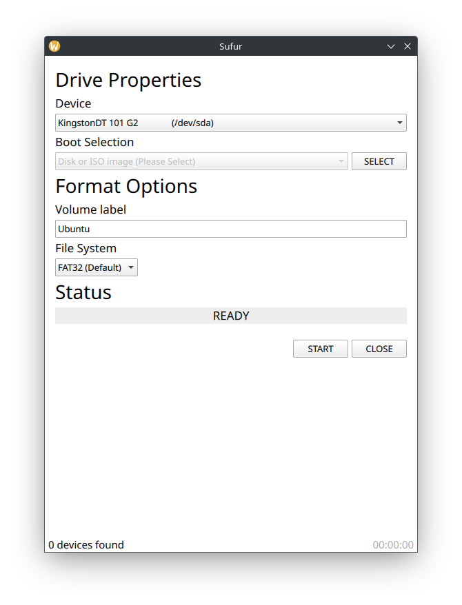

# Sufur: Sufur is not Rufus

Sufur is a tool that aims to mimic the capabilities of Rufus on Linux

## Features
- Lists 1 USB drive connected to your device
- Closes when you click "CLOSE" button

## Compilation
Clone the repo, build the submodules, open CMakeLists.txt in Qt Creator and hit Run

## Additional Information
This project is not affiliated with Rufus in any way and is simply a hobby project for me to learn about C, C++ and Linux.

The license is GPLv3

## Enhancements/Bugs
Please create an issue if any of the above listed features don't work for you.