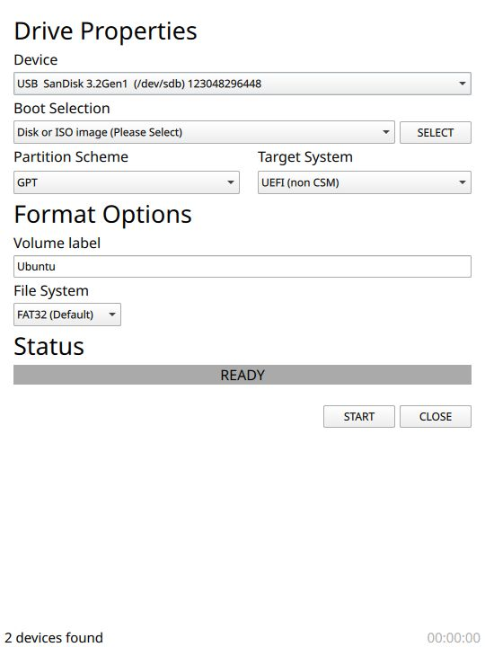

# Sufur: Sufur is not Rufus

Sufur is a tool that aims to mimic the capabilities of Rufus on Linux

## Features
Sufur is under active development but the following features are working in some form:

- Format the USB drive (FAT32, NTFS, exFAT, ext2, ext3, ext4)
- Make bootable USB for UEFI systems using File System Transposition (Windows and Linux ISOs supported)
- Make Windows To Go drive.

## Compilation
Clone the repo, build the submodules, open CMakeLists.txt in Qt Creator and hit Run

## Additional Information
This project is not affiliated with Rufus in any way and is simply a hobby project for me to learn about C, C++ and Linux.

The license is GPLv3

## Enhancements/Bugs
Please create an issue if any of the above listed features don't work for you.
